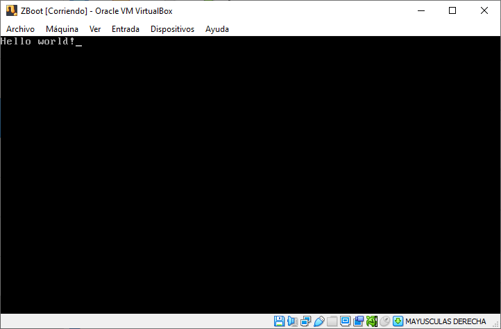
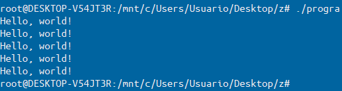
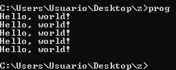

 
<link rel="shortcut icon" type="image/x-icon" href="favicon.png?">

# Get the last version of ZCC
 <code class="scode">version 0.25</code>
  

## Download for Windows

  <a target="_blank" href="https://github.com/bruneo32/zcc/tree/main/download/windows/installer" id="download-any" class="button">
    Download Setup
  </a>
  <a target="_blank" href="https://github.com/bruneo32/zcc/tree/main/download/windows/zip" id="download-zip" class="button">
    Portable .zip
  </a>

## Download for Linux
Especial thanks to <a target="_blank" href="https://github.com/arf20">@arf20</a>

  <code class="scode">apt install zcc</code>
    
  <a target="_blank" href="https://github.com/bruneo32/zcc/tree/main/download/linux/deb" id="download-any" class="button">
    Download Deb
  </a>
  <a target="_blank" href="https://github.com/bruneo32/zcc/tree/main/download/linux/targz" id="download-tar-gz" class="button">
    Portable .tar.gz
  </a>

## Extra

  <a target="_blank" href="https://github.com/bruneo32/zcc/tree/main/source" id="download-any" class="button">
    Source code
  </a>
  <a target="_blank" href="https://github.com/bruneo32/zcc/tree/main/download/extra" id="download-npp" class="button">
    Notepad++ UDL
  </a>
  <a target="_blank" href="https://github.com/bruneo32/zcc/tree/main/download/extra/examples" id="download-zip" class="button">
    Examples
  </a>

# Z language
Z is a programming language which extends Assembly to a

### Examples
Example of a simple BOOT sector in Z
<pre>
org 0x7c00
bits 16
zdefine

callf print_str(str_hello)

cli
hlt

def str_hello = "Hello world!",0

function print_str(si){
  while ($si != 0){
    callf print_char($si)
    si++
  }
}

#include "myfunctions.z"
// #include &lt;math&gt;
/*
  Multiline
  comment
*/
  

buf[510-($-$$)]
db 0x55,0xAA
</pre>

`zcc main.z main.asm -nasm:{-f bin main.flp}`

 
Example of a "Hello world!" executable in Z
<pre>
global _start

bits 32
zdefine ; Call this always after defining bits

section .text
_start:
  // Program entry point
  
  for(cx=0, cx<5, cx++){
    callf printstrln(str_hello)
  }
  
  // Program end
  callk end0()

// Program variables
section .data
def str_hello = "Hello, world!",0

#include &lt;stdio&gt;
</pre>

Linux:

`zcc main.z main.asm -nasm:{-f elf32 main.o} -link:{main.o -o progra -melf_i386}`
or
`zcc main.z progra -elf32`

Windows:

`zcc main.z main.asm -nasm:{-f win32 main.o} -golink:{main.o /fo:prog.exe /console}`
or
`zcc main.z prog.exe -win32`

